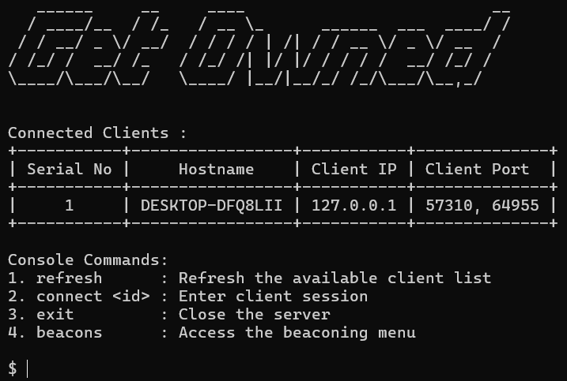

# Command and Control (C2) Server

## What is a Command and Control Server ?

A <b>Command and Control (C2)</b> server is a tool used to remotely manage systems and devices. It can send commands, receive data, and execute tasks on client machines, typically in a networked environment. While C2 systems are often used in cybersecurity research, they can also be used maliciously by attackers to control compromised systems.

This tool is made as part of a B.Tech Project, and is meant to closely resemble an enterprise-level C2 / red-teaming framework.  That said, it does provide actual data exfiltration and RCE, and hence <b>must be executed only on systems where permission has been granted by the owner</b>.

All versions of the tool can be found in the repo, with the latest being ~~**V11**~~ **V13**.

  

---

## Setup Instructions

### Requirements and Startup

The client side executable is made with the intention that it must be able to run on ANY windows system, and hence only depends on dynamically linked DLLs present in the Windows SDK.

To create the executable, run 
`gcc -w -o client13.exe client_v13.c anti-debug.c sandbox.c -Wl,-Bstatic -lcrypto -lssl -lz -Wl,-Bdynamic -lws2_32 -lgdi32 -lbcrypt -lcrypt32 -lcurl -ljansson -lnetapi32` 

As for server and proxy, run `pip3 install -r requirements.txt` to install all 3rd party requirements.

--- 

### Setup 

#### Server

1. Download all the requirements by running the pip command.
2. Place the server in the attacker system, along with the three certificates required (server_cert, server_key, ca_cert).
3. Run the server.

#### Proxy

1. Repeat the steps done in the server, except this time use the certificates pertaining to the proxy-server connection (proxy_cert, proxy_key, ca_cert), and run the proxy.
2. As the proxy requests for an IP, add the server's public IP address.

#### Client

1. Compile the file with the command given above.
2. Execute the client to begin reconnissance.

---

## ~~Highlights of Version 11~~

* ~~**DHKE and AES**~~
  - ~~An RFC 3526 compliant DHKE is performed using group 14.  Shared secret is used to obtain 16-byte key for AES-256, which is performed in conjunction with URL-safe base64 encoding for potential protocol change.~~

* ~~**Detailed logging and Audit Trails**~~  
  - ~~All reverse proxy connections and network transmissions are logged robustly for future analysis.  On server side, all executed commands and outputs are logged and timestamped for easy analysis.  Future versions might include using a cryptographically secure database for easier access.~~

* ~~**Enhanced SSL/TLS Security**~~  
  - ~~Proxy - Server connection functions under mTLS with self-signed certificates.  Client - Proxy connection is unencrypted TCP, but all transmitted data is encrypted and encoded with secure cryptographic measures.~~

* ~~**Session Management and other features**~~  
  - ~~Allows handling multiple connections at once.~~
  - ~~Allows executing commands or script and retrieving all displayed output.~~
  - ~~Provide a form of persistence to the executable, such as launching on start up.~~
  - ~~Beaconing (WIP)~~

---

## Future Versions

~~As development continues, new features and improvements will be added in future versions.~~
~~Features to be implemented :~~
- ~~DNS based covert communication (such as DoH or DNS tunneling).~~
- ~~Dynamic limiting of network bandwidth for transfer of exfiltrated data.~~
- ~~Advanced beaconing and persistence of malware.~~

As development continues, new features and improvements will be added in future versions.

Version 13 is the current release, and its features will be updated and enhanced in future versions.

Stay tuned for updates!

---

## Disclaimer

This software is for educational and research purposes only. Ensure you have proper authorization before using it on any network or system. The creators are not responsible for any misuse or consequences that arise from its use.

---
