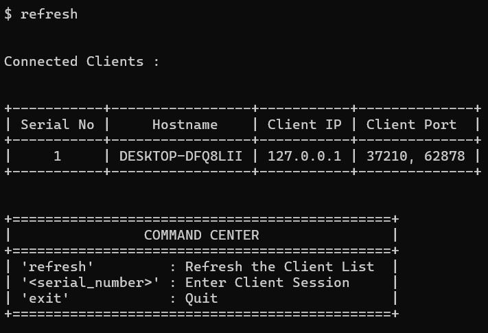

# Command and Control (C2) Server

## What is a Command and Control Server ?

A **Command and Control (C2)** server is a tool used to remotely manage systems and devices. It can send commands, receive data and execute tasks on client machines, typically in a networked environment. While C2 systems are often used in cybersecurity research, they can also be used maliciously by attackers to control compromised systems. 

This tool is made as part of a B.Tech Project, and is meant to closely resemble an enterprise-level C2 / red-teaming framework.  That said, it does provide actual data exfiltration and RCE, and hence **must be executed only on systems where permission has been granted by the owner.**

All versions of the tool can be found in the repo, with the latest being **V7**.

  

---

## Setup Instructions

### Requirements and Startup

The client side executable is made with the intention that it must be able to run on ANY windows system, and hence only depends on dynamically linked DLLs present in the Windows SDK.

To create the executable, run `gcc client_v7.c -o client_exec -lws2_32 -lbcrypt -lcrypt32` 

As for server and proxy, run `pip3 install -r requirements_glob.txt` to install all 3rd party requirements.

--- 

### Setup 

#### Server
1. Download all the requirements by running the pip command.
2. Place the server in the attacker system, along with the three certificates required (server_cert, server_key, ca_cert).
3. Run the server.

#### Proxy
1. Repeat the steps done in the server, except this time use the certificates pertaining to the proxy-server connection (proxy_cert, proxy_key, ca_cert), and run the proxy.
2. As the proxy requests for an IP, add the server's public IP address.

#### Client
1. Compile the file with the command given above.
2. Execute the client to begin reconnissance.

---

## Features in Version 7

* **AES Encryption**  
  - All communications made between server and client are in base64 encoding, and encrypted with AES-256 to provide security during data transmission.  The key in **V7** is hardcoded into the client, but will be converted into a KDF derived key in future versions.

* **Improved Command Execution and Error Handling**  
  - Error handling has been implemented with ease of use in mind, making debugging easier and more understandable.

* **Robust Logging**  
  - All reverse proxy connections and network transmissions are logged robustly for future analysis.

* **Detailed Audit Trails**  
  - All exfiltrated data is logged comprehensively on the server side with timestamps.  Future versions may include the data being stored encrypted in a local database for ease of access.

* **Enhanced SSL/TLS Security**  
  - Proxy - Server connection functions under mTLS with self-signed certificates.

* **Dynamic Session Management**  
  - New functionality allows for dynamic management of client sessions, improving scalability.

---

## Future Versions

As development continues, new features and improvements will be added in future versions.
Features to be implemented :
- DNS based covert communication (such as DoH or DNS tunneling).
- Client and Server side KDF, with secure transmission of master key.
- Dynamic limiting of network bandwidth for transfer of exfiltrated data.
- Advanced beaconing and persistence of malware.

Stay tuned for updates!

---

## Disclaimer

This software is for educational and research purposes only. Ensure you have proper authorization before using it on any network or system. The creators are not responsible for any misuse or consequences that arise from its use.

---
